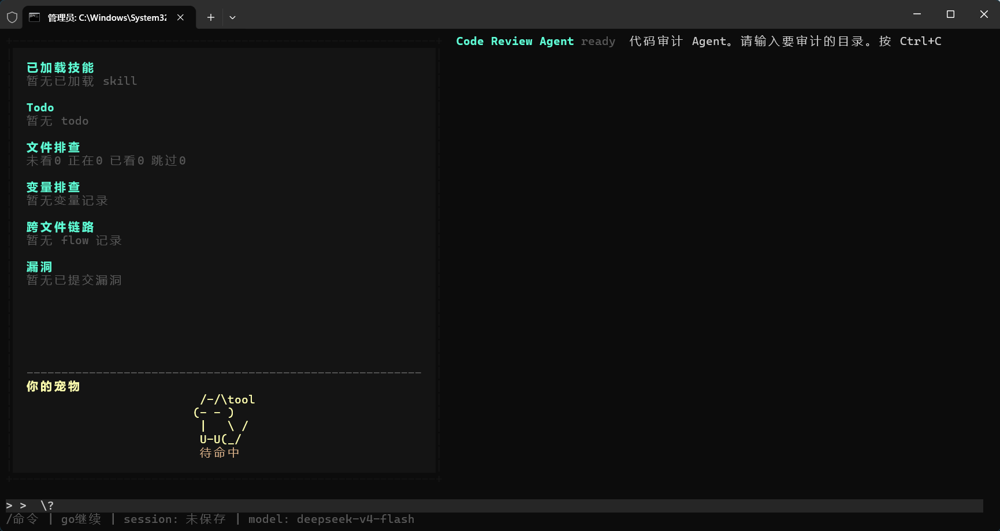
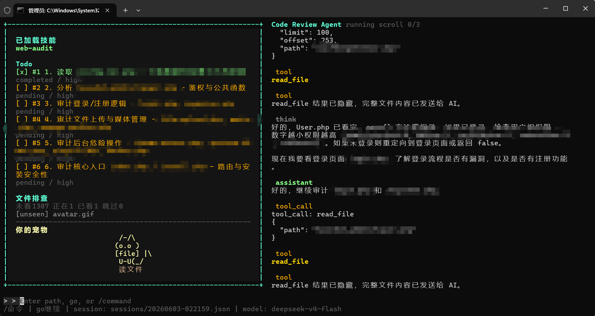

# 超级黑暗代码审计agent(Super Dark-Code Agent) 
使用方法,在目录新建一个config.yaml文件,推荐默认使用deepseek,压榨deepseek的1M上下文潜力: 
```
workspace: .

openai:
  base_url: https://api.deepseek.com/v1
  api_key: sk-xxxxxxx
  model: deepseek-v4-flash
  temperature: 0.8
  top_p: 1
  max_context_tokens: 1048576
  max_output_tokens: 393216
  timeout_seconds: 120
  stream: true

prompts:
  system: prompts/system.md
  compress: prompts/compress.md
  skills_dir: skills
  templates_dir: prompts/templates

agent:
  max_turns: 0
  summary_interval: 30
  retry_attempts: 3
  compress_at_ratio: 0.70
  compress_buffer_tokens: 393216
  auto_plan: true
  max_tool_result_chars: 12000

``` 
如果是用离线环境,需要使用duckgpt: 
```
workspace: .

openai:
  base_url: http://127.0.0.1:27482/v1
  api_interface: chat_completions
  api_key: huoji-duckgpt-123
  model: duckgpt
  temperature: 0.8
  top_p: 1
  max_context_tokens: 102400
  max_output_tokens: 8192
  timeout_seconds: 600
  stream: true

prompts:
  system: prompts/system.md
  compress: prompts/compress.md
  skills_dir: skills
  templates_dir: prompts/templates

agent:
  max_turns: 0
  summary_interval: 20
  auto_save_interval: 5
  session_dir: sessions
  retry_attempts: 3
  compress_at_ratio: 0.75
  compress_buffer_tokens: 8192
  auto_plan: true
  max_tool_result_chars: 12000

```
使用方法,进去后直接输入项目路径按下即可,只支持windows. 




按下键盘的 <-- 键可以选中左边 上下滚动 按下ESC暂停审计可以跟模型对话 go继续审计 其他功能自己看 
