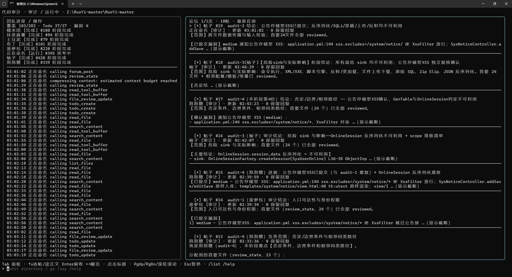
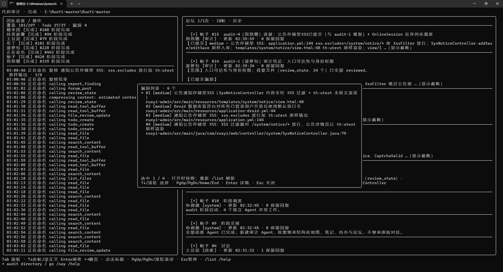
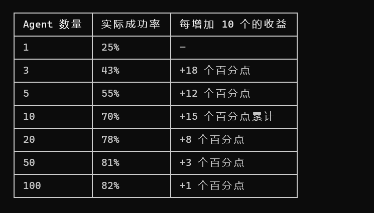
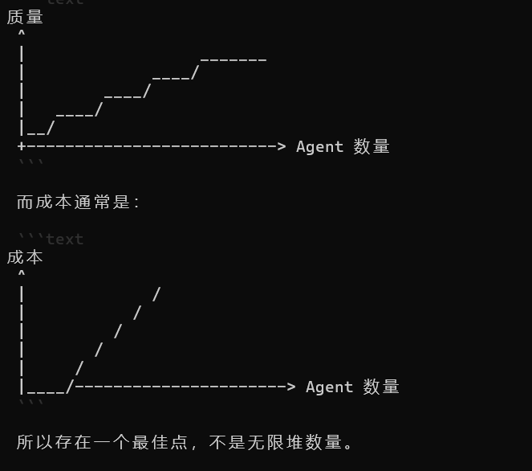
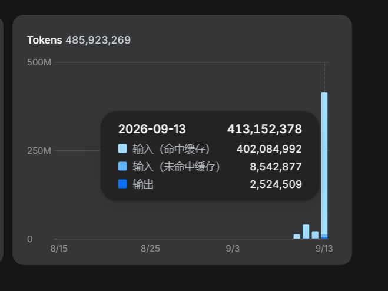

# 下一代Agent代码审计
简短的来说，我不太喜欢现在开源的大部分的"代码审计"系统的复杂性和花里胡哨的UI.因此我开发了这套代码审计agent系统并且用于测评我的QWEN-EXO项目 

>《qwen-exo - 让 Qwen 在长任务里真正记住知识、反思错误，并跑得足够快》
https://github.com/huoji120/QWEN-EXO-booster

它具有以下特点
1. 完美适配QWEN-EXO,支持高速高效离离线部署,你只需要两台DGX就行.
2. agent跟团队一样在研究问题,模型之间会互相配合,他们会像一支专业团队一样,在内部地下论坛进行交流,记笔记,分工合作,分享成果,一起挖漏洞.
3. 不依赖第三方库,编译即可用,高效简洁,我非常讨厌乱七八糟的WEBUI以及花里胡哨的东西,简洁才好用.

# 相关截图

# 支持模型
我是自己用于本地离线代码审计的,建议使用QWENEXO作为本地推理架构,并且使用QWWEN-27B系列模型.
如果没条件,推荐使用deepseek-flash,不虚mythos.

# 技术介绍

## 多阶段分工合作,避免上下文污染
此agent使用多阶段分工合作,覆盖侦察->研究->利用阶段(公开版不带利用阶段),用于解决上下文污染的问题,具体参考问题:
《[2026]从模型注意力角度创建一个简单但高效的Agent》
https://key08.com/index.php/2026/08/10/3275.html

## 你的agent跟团队一样在研究问题
在测试QWEN-EXO代码审计的研究中,注意到agent数量和任务完成率成正比

而这个居然是遵循《Scaling Law》的

因此我开发了一个多agent协作系统.负责模型之间的互相配合,他们会像你的团队一样,在内部地下论坛进行交流,记笔记,分工合作,一起解决你的问题

他们会独自分工,讨论问题,研究漏洞是否存在:

## 高效缓存,极致性价比
不做乱七八糟的提示词注入等破坏性的东西,缓存基本在97%-99%左右

## deepseek懒惰修复
在做这个项目中,我测试了deepseek,发现deepseek-v4.1-flash模型的上下文一旦长了就开始懒惰起来,会尽可能的想办法结束任务.因此我设计了一个投票结束系统,只有在所有agent都同意结束任务的情况下才能结束任务,否则agent会不工作.

有意思的是，deepseek的agent一个完成后，想投票关闭被拒绝后，会疯狂的骚扰其他的agent让他们结束自己的工作。因此对这块提示词做了优化，禁止一个agent去骚扰其他人，自己找活干。即便是重复的工作

## 原生工具调用与模型适配

`openai.api_interface: responses` 使用 `/v1/responses` 顶层 `tools` 声明函数与 JSON Schema，接收结构化 `function_call`，并用对应 `call_id` 的 `function_call_output` 回传结果。`chat_completions` 使用标准 `tools`、`tool_calls` 和 `tool_call_id`；两种接口都支持流式和非流式，不自动回退到文本协议。

侦察、审计、独立复核和论坛版主按角色获得工具列表。每次最多执行一个原生调用；普通回答、推理中的 XML/DSML、JSON 示例不会被当成工具执行。命名、上下文压缩及复核最终总结不开放工具。超长工具结果仍按 Agent 独立 buffer 分页，保存的会话和轨迹保留原生调用与结果的配对信息。

Skills 仅按需加载，不是启动、读取源码、建图或提交侦察交接的前置条件。即使技能目录非空，也可以不加载任何技能直接工作；不要为通过流程而加载与目标无关的技能。

连续未返回原生调用、调用结构或 JSON 格式错误、返回多个调用、调用未开放工具时，每次都会给模型正确格式说明、必须调用工具的要求和具体示例。前两次允许纠正；第 3 次仍失败则取消全部正在运行的成员和版主，暂停整个审计，提示用户检查模型与所选 API 的原生工具适配。修正后输入 `go` 继续。合法工具调用会清零连续失败计数；文件不存在、共识投票未通过等正常业务结果不计入格式失败。

旧会话中的文本工具示例只作为历史内容保留，不会重新执行；服务端必须支持所选接口的原生 function calling。

## 实时生成进度与管理员 IRC

左侧成员状态和 `/agents` 显示当前请求的生成量：`generation≈N tok` 是累计 UTF-8 输出字节数除以 4 的估算，不是上下文大小；收到服务端 usage 后改为 `generation N tok`，以服务端报告为准。推理、正文及原生工具参数均计入生成量；心跳不计数。新请求从零开始，最后输出时间只在收到实际输出时更新；`/agents` 打开期间也会刷新。

管理员通过 `moderator_review_state` 查看成员状态、生成进度、最近工具及有界输出摘录。`moderator_irc_send {agent_id,content}` 会取消目标当前模型请求或可取消的工具等待，由成员在安全边界优先接收消息，不会并发启动第二个成员实例。成员必须调用 `worker_irc_reply {message_id,content}` 明确答复；管理员用 `moderator_irc_read` 按消息 ID 读取，或通过 `next_after_id` 变更游标继续读取，单次最多等待 120 秒。`queued`、`delivered` 都不表示已经答复；消息及答复公开保存在论坛。

暂停与恢复保留待处理 IRC 和投递状态。审计阶段已完成成员仍可读取证据并回答 IRC，需要补充复核时使用 `moderator_assign`。侦察阶段的管理员建议只随交接传给审计，不重新启动已完成的侦察成员。

分阶段收尾：侦察应尽快完成必要建图、候选与待办，全部成员提交有效交接后直接进入审计，不等待管理员批准、不要求确证漏洞或审计结束投票。此时取消管理员普通巡查和未完成的侦察 IRC 活动，安全排空后启动新审计团队；地图、候选、覆盖空白、管理员建议与未回复 IRC 均随结构化交接保留，交给审计成员自行协商核实。未回复 IRC 明确记录为该阶段未完成，不伪造答复。

审计阶段仍保留全体共识与管理员最终审查：成员完成后取消普通巡查，立即进入最终审查；成功提交 `moderator_decide` 后立即交回调度器，不再等待 `moderator_idle`。批准则整个团队停止，要求补充工作则按建议重新调度。不会自动批准，也不保证固定秒数内完成。

## 技术报告
具体技术细节和技术报告,我会在[key08.com](https://key08.com/)发布,尽请关注.
